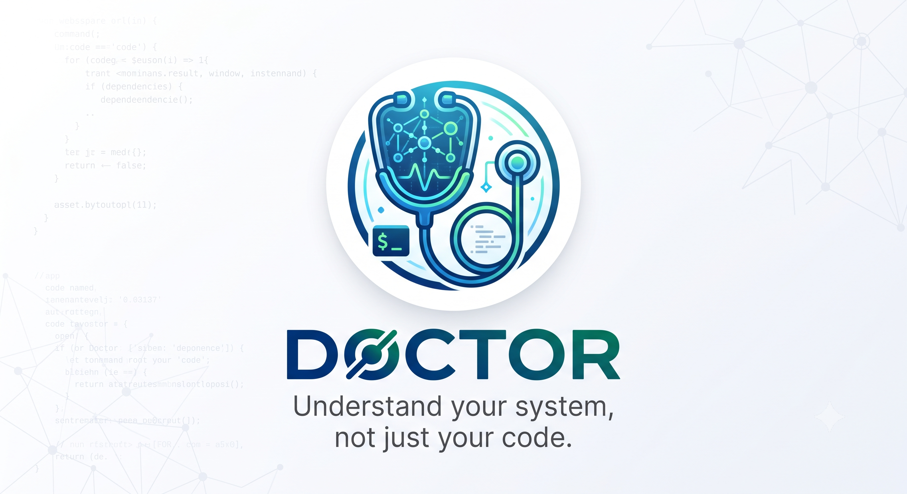

<picture>
  <source media="(prefers-color-scheme: dark)" srcset="assets/banner.png">
  
</picture>

# Doctor

> Understand your system, not just your code.

Doctor is an AI-native diagnostic engine for developers.

Instead of generating code, Doctor helps you understand why your systems behave the way they do. It builds runtime-aware models, gathers evidence, applies diagnostic rules, and uses AI to explain root causes with confidence.

Built as a CLI-first platform with support for plugins, MCP, and CI/CD integrations, Doctor aims to become the universal diagnostic engine for modern software systems.

**Doctor doesn't replace developers or AI assistants. It gives them something they don't have: reliable diagnosis backed by evidence.**

## Features

- **System Scanning** — Auto-detects Maven/Gradle, Spring Boot version, and project dependencies
- **System Modeling** — Builds Bean dependency graph, auto-configuration model, and configuration property model
- **Evidence Collection** — Gathers facts from source code, config files, and Actuator runtime endpoints
- **Rule Engine** — 8 built-in diagnostic rules covering Bean, Config, Transaction, AutoConfig, and Startup
- **AI Explanation** — Natural language explanations of diagnostic findings (optional, offline-capable core)
- **Multi-format Output** — Terminal (colored), JSON, Markdown, HTML, SARIF
- **Plugin Architecture** — Trait-based plugin system for extending to new technologies

## Quick Start

```bash
# Build
cargo build --release

# Run diagnosis on a Spring Boot project
./target/release/doctor diagnose /path/to/spring-boot-project

# JSON output
./target/release/doctor diagnose . --output json

# AI explanation (requires LLM API key)
export DOCTOR_LLM_KEY="your-api-key"
./target/release/doctor explain diagnosis-report.json
```

## Installation

### From Source

```bash
git clone https://github.com/conifercone/doctor.git
cd doctor
cargo build --release
```

### Requirements

- Rust 1.85+ (stable, edition 2024)
- For Spring Boot project diagnosis: target project with Maven or Gradle

## Documentation

- [Product Requirements (PRD)](docs/PRD.md)
- [Feature Specification](specs/001-diagnostic-engine-core/spec.md)
- [Implementation Plan](specs/001-diagnostic-engine-core/plan.md)
- [Data Model](specs/001-diagnostic-engine-core/data-model.md)
- [CLI Contract](specs/001-diagnostic-engine-core/contracts/cli-schema.md)
- [Quickstart Guide](specs/001-diagnostic-engine-core/quickstart.md)

## License

Apache-2.0
